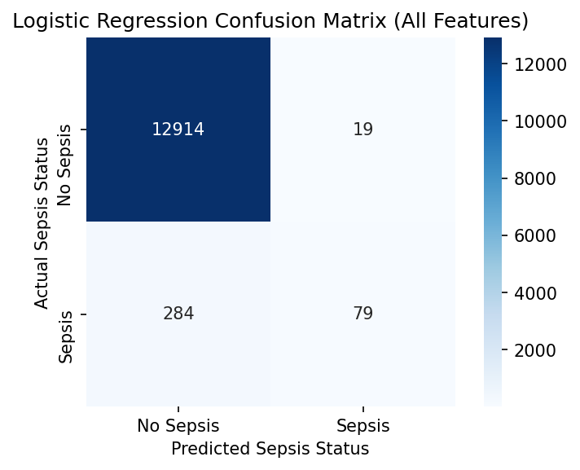

## Logistic Regression Analysis

I trained an sklearn Logistic Regression model trained on all features in my dataset.

The model has high accuracy and precision (0.9772 and 0.8061, respectively), however, it has a low recall score.

### Notes about the dataset:
* there were significant numbers of NaN values
* I captured a little over 16,000 rows of data by finding a combination of columns that had large numbers of non-null values

## Plan

I plan to increase the size of my dataset by imputing NaN values, rather than searching for a combination of columns with high non-null values.

Furthermore, I would like to fit a Random Forest Classifier and adjust my feature selection based more on correlation.
